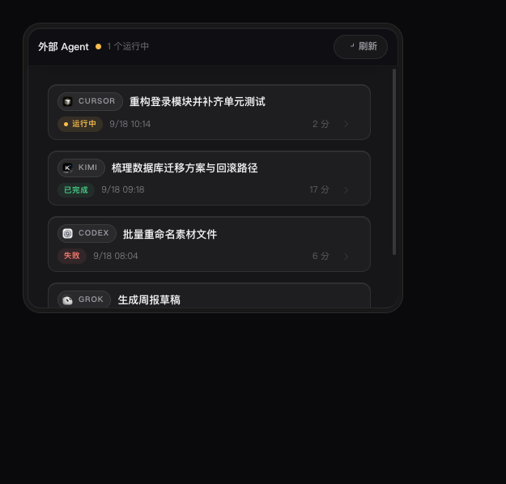

# External Agents Extend

[](LICENSE)

> 在 DimAgent 里查看外部 Agent 委托任务的执行日志——运行状态、工具调用、中间输出与失败原因。

DimAgent 通过 `agent create_external` 把任务交给外部 Agent（Kimi、Cursor、Codex 等）异步执行时，界面上只有任务状态和最终摘要，**执行过程不可见**。这个插件补上这一环：外部 Agent 各自把完整的执行轨迹写在本机（JSONL / SQLite），插件读取、归一化并展示出来。


## 功能

- **任务列表** — 列出本会话（或全部历史）委托给外部 Agent 的任务：Agent 类型、状态、开始时间与耗时
- **执行日志** — 点击任务查看完整事件流：工具调用、文件读取、命令输出、思考过程与错误信息；运行中的任务每 2 秒增量刷新
- **会话内嵌卡片** — 在对话里直接显示任务卡片，点击即全屏打开实时日志
- **自动状态提示** — 每轮对话自动感知运行中的外部任务；新任务启动后自动展示状态卡片，不用主动问
- **CLI** — `list` / `show` / `tail` 三个命令，支持 `--json`，便于脚本消费
- **纯本机** — 只读本地数据、不联网，不修改 dim 或任何 Agent 的原始文件

## 要求

- **DimAgent 桌面版**（含插件系统与 MCP App 支持；实测于 0.9.32）
- 无需额外安装任何东西：插件零第三方依赖，使用 DimAgent 内置的 Node 运行时

## 安装

**从 GitHub 安装（推荐）**

Dim 桌面 → Plugins → Add plugin，填入仓库地址：

```
https://github.com/sunny0826/dim-external-agents-extend
```

或使用 CLI：

```bash
dim plugin install https://github.com/sunny0826/dim-external-agents-extend
```

安装后**重启 DimAgent** 生效。

**本地开发安装**（改代码即时生效）

```bash
ln -s "$(pwd)" ~/.agents/plugins/external-agents-extend
```

## 使用

### 在对话里

直接问你的 Agent 即可：

- 「刚才那个 cursor 任务跑到哪了？」
- 「列出最近的外部 Agent 任务」
- 「这次委托为什么失败？」

插件提供四个工具，模型会自动调用：

| 工具 | 作用 |
| --- | --- |
| `list_agent_runs` | 列出委托任务（可按 Agent 类型、状态过滤） |
| `read_agent_run` | 读取某个任务的执行日志（分页 + 增量轮询） |
| `show_external_agents` | 在对话中显示任务卡片（点击进实时日志） |
| `open_agent_run_log` | 打开全屏日志面板 |

也可以从输入区的「技能」按钮或斜杠菜单选择 `/external-agents-extend`，直接打开日志面板。

### 全屏日志面板


- 顶部是任务上下文：Agent、标题、状态与时间范围
- 事件流按类型分块：消息气泡、工具调用（「工作过程」折叠块，展开可看每一步）、系统事件（可折叠）
- 「跟随」开启时自动滚动到最新；运行中的任务每 2 秒增量追加
- 勾选「全部会话」看历史任务，勾选「显示已结束」看已完成 / 已取消的任务

### 会话内嵌卡片



### CLI

插件附带命令行工具，在 dim 的 exec 环境中可直接使用：

```bash
dim-external-agents-extend list                    # 最近任务
dim-external-agents-extend list --type cursor      # 只看 cursor
dim-external-agents-extend show <taskId>           # 查看某个任务的日志
dim-external-agents-extend tail <taskId>           # 持续跟踪（默认 2s 间隔）
dim-external-agents-extend show <taskId> --json    # JSON 输出，便于脚本消费
```

## 支持的 Agent

| Agent | 任务列表 | 执行日志 | 日志中的时间戳 |
| --- | :---: | :---: | --- |
| Kimi | ✅ | ✅ | 完整（逐条） |
| Cursor | ✅ | ✅ | 任务级（无逐条时间，见 FAQ） |
| Codex | ✅ | ✅ | 完整（逐条） |
| Grok / OpenCode / ZCode | ✅ | 暂未支持 | — |

> 任务列表来自 dim 自身的任务库，因此所有 Agent 类型都能列出；执行日志需要按各 Agent 的会话格式单独适配，目前完成了 Kimi / Cursor / Codex 三种。

## 常见问题

**打开面板是空白的？**
`ui://` 资源在宿主内有内存缓存。安装或更新插件后需要重启 DimAgent。

**看不到我的任务？**
面板默认只显示「当前会话」委托的任务。勾选顶部的「全部会话」查看历史，勾选「显示已结束」查看已完成 / 已取消的任务。

**时间列是空的？**
Cursor 的会话日志（`store.db`）本身不记录逐条消息时间，只有任务级时间范围（显示在日志页顶部）；Kimi / Codex 的日志包含完整时间戳。

**日志显示「降级读取（部分格式未识别）」？**
该 Agent 的日志格式出现了插件未识别的部分。数据不会丢，但部分事件可能以原始形态显示——欢迎提 issue 附上任务 ID。

**任务显示「没有可读日志」？**
两种情况：① 该任务对应的外部会话已被清理（超出 Agent 自身的会话保留期）；② 该 Agent 类型的日志读取尚未支持（Grok / OpenCode / ZCode）。

**任务显示「任务不存在」？**
任务记录已被清理，或 taskId 有误。

## 卸载

```bash
rm -rf <DIMCODE_HOME>/plugins/external-agents-extend
```

或从 Dim 桌面 → Plugins 中移除。插件不写入持久状态（仅在系统临时目录记录当前会话 ID，用于默认过滤，由系统自动清理），删除目录即可完全卸载。

## 开发

- 开工入口（已验事实、数据源地图、调试命令）：[docs/HANDOFF.md](docs/HANDOFF.md)
- 阶段开发记录：[docs/DEVELOPMENT.md](docs/DEVELOPMENT.md)
- 验证证据：[docs/verification/](docs/verification/)

```bash
mise exec -- node --test   # 运行全部测试（90 项）
```

## 许可证

本项目采用 [MIT 许可证](LICENSE)。

界面中展示的 Agent 图标（Kimi / Cursor / Codex / Grok / OpenCode / ZCode）版权归各厂商所有，仅作本机界面标识用途，不在本项目许可证的覆盖范围内；图标由 `scripts/build-logos.js` 从本机已安装的应用中提取。
