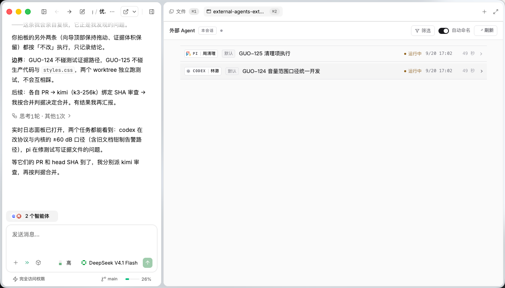
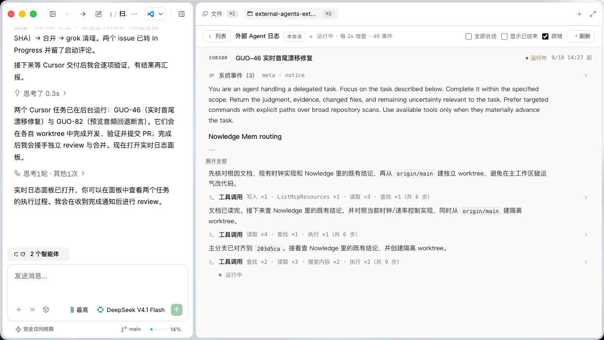

# Dim External Agents Extend

[English](README.md) | 简体中文

[](LICENSE)

> 在 DimAgent 里查看外部 Agent 委托任务的执行日志——运行状态、工具调用、中间输出与失败原因。

DimAgent 通过 `agent create_external` 把任务交给外部 Agent（Kimi、Cursor、Codex 等）异步执行时，界面上只有任务状态和最终摘要，**执行过程不可见**。这个插件补上这一环：外部 Agent 各自把完整的执行轨迹写在本机（JSONL / SQLite），插件读取、归一化并展示出来。



## 功能

- **任务列表** — 列出本会话（或全部历史）委托给外部 Agent 的任务：Agent 类型、模型、状态、开始时间与耗时
- **执行日志** — 点击任务查看完整事件流：工具调用、文件读取、命令输出、思考过程与错误信息；Agent 文本按 Markdown 渲染（标题、列表、表格、代码块）；运行中的任务每 2 秒增量刷新
- **会话内嵌卡片** — 在对话里直接显示任务卡片，点击即全屏打开实时日志
- **自动状态提示** — 每轮对话自动感知本会话运行中的外部任务；任务完成/失败后主动补报结果；新任务启动后自动打开实时日志面板，不用主动问
- **会话名称统一** — 各外部 Agent 会攒下五花八门的会话名（`Help`、`Code Review Agent`、`New session - 2026-09-16T…`），插件把它们统一成一种格式：`[codex] 09-19 20:31 · 修复 GUO-108 审查问题`；并可把统一名称写回 Agent 自己的会话存储，让它的 `resume` 列表也变干净
- **CLI** — `list` / `show` / `tail` / `sessions` / `rename` 命令，支持 `--json`，便于脚本消费
- **纯本机** — 只读本地数据、不联网；不写 dim 自己的数据库，唯一的写入是你显式确认过的会话改名（写前自动备份）

## 要求

- **DimAgent 桌面版**（含插件系统与 MCP App 支持；实测于 0.9.32）
- 无需额外安装任何东西：插件零第三方依赖，使用 DimAgent 内置的 Node 运行时

## 安装

**从 GitHub 安装（推荐）**

Dim 桌面 → Plugins → Add plugin，填入仓库地址：

```
https://github.com/sunny0826/dim-external-agents-extend
```

或使用 CLI：

```bash
dim plugin install https://github.com/sunny0826/dim-external-agents-extend
```

安装后**重启 DimAgent** 生效。

**本地开发安装**（改代码即时生效）

```bash
ln -s "$(pwd)" ~/.agents/plugins/external-agents-extend
```

## 使用

### 在对话里

直接问你的 Agent 即可：

- 「刚才那个 cursor 任务跑到哪了？」
- 「列出最近的外部 Agent 任务」
- 「这次委托为什么失败？」

插件提供七个工具，模型会自动调用：

| 工具 | 作用 |
| --- | --- |
| `list_agent_runs` | 列出委托任务（可按 Agent 类型、状态过滤；`sessionId` 指定某个 dim 会话） |
| `read_agent_run` | 读取某个任务的执行日志（分页 + 增量轮询） |
| `list_external_sessions` | 列出各 Agent 自己的会话，带统一展示名 |
| `rename_external_sessions` | 把统一名称写回 Agent 的会话存储（默认只预览） |
| `auto_name_sessions` | 回填更早的 dim 委托会话名称 |
| `restore_backups` | 从备份目录回滚改名 |
| `get_settings` / `set_auto_name` | 读 / 改自动命名开关（面板上的开关就走这两个工具） |
| `show_external_agents` | 在对话中显示任务卡片（点击进实时日志） |
| `open_agent_run_log` | 打开全屏日志面板 |

也可以从输入区的「技能」按钮或斜杠菜单选择 `/external-agents-extend` 直接打开日志面板，或选择 `/external-session-names` 整理会话名称。

### 全屏日志面板



- 顶部是任务上下文：对应 Agent 的 logo、Agent、模型、标题、状态与时间范围
- 事件流按类型分块：Agent 文本（Markdown 渲染，含表格）、工具调用（「工具调用」折叠组，展开可看每一步）、思考与系统事件（可折叠）
- 「跟随」开启时自动滚动到最新；运行中的任务每 2 秒增量追加
- 列表页的筛选收在一个 **筛选** 按钮里，弹出面板**覆盖全部状态**（运行中 / 已完成 / 已取消 / 失败，可多选）加一个范围开关（本会话 / 全部会话）；默认只看本会话的运行中任务，一键即可看到任意状态或全部状态。筛选与「自动命名」开关都是列表页控件——进入某个任务的日志详情页后都不显示（详情页是「跟随」开关）

### 会话名称统一

各外部 Agent 各自维护会话存储，标题五花八门：Codex 中英混杂且有泛化标题（`Help`、`Simplify and refactor codebase`），Cursor 是笼统英文（`Code Review Agent`），OpenCode 用 `New session - 2026-09-16T14:12:03.160Z`，Kimi 有时把整段 prompt 当标题，Grok 的目录名是 URL 编码路径。插件把它们统一成一种格式，并标出来源：

```
[codex] 09-19 20:31 · [dim] 修复 GUO-108 审查问题     ← 由 dim 委托产生
[codex] 09-19 12:31 · [手动] 维护本地 skill           ← 其它来源
```

名称按以下顺序推导：

1. **dim 任务标题** —— dim 委托过的会话优先用它，本来就是人话；
2. **会话自身标题** —— 除非它是通用标题（`Help`、`New session - <ISO>`、纯 UUID 或路径，或只剩委托前缀的「你是实现者」）；带委托前缀的会先剥掉前缀（`你是 Project V 的执行开发者。任务：时间轴重构` → `任务：时间轴重构`）；
3. **会话首条 prompt** —— 跳过委托包装样板（`You are an agent handling a delegated task…`），含 Issue 编号（`GUO-108`）的行优先；
4. **兜底** —— `未命名会话 · <工作目录末段 或 会话短码>`。

#### 自动命名（默认关闭）

开启之后，dim 委托任务，hook 就会**自动**把该外部会话的泛化标题改成统一名——不用在对话里说，也不用敲命令。**默认关闭**：改名会写进别的工具自己的存储，需要你显式打开。

三种等价的开法：

- **面板里点**：打开全屏日志面板，在**列表页**右上角点「自动命名」（在「显示已结束」和「刷新」之间）——它是全局设置，所以不进具体任务的日志详情页；
- **对话里说**：直接说「把自动命名打开 / 关掉」（模型调用 `set_auto_name`）；
- **命令行**：`dim-external-agents-extend autoname --enable` / `--disable`（写 `~/.dimcode/ea-extend-config.json`）。

（也可以手工写 `~/.dimcode/ea-extend-config.json` 的 `{ "autoName": true }`，或设环境变量 `EA_EXT_AUTO_NAME=on`——注意 macOS 桌面 App 不继承 shell 的 export，配置文件才可靠。优先级：环境变量 > 配置文件 > 默认关闭。）

开启后：

- 只处理**能关联到 dim 任务**的会话，你手动开的会话一律不碰；
- 只改写**泛化标题**；名称已有信息量、或你自己设过标题的，一律不动；
- 只回溯最近 **2 小时**内委托的任务，不翻旧账；
- 每次写入前自动备份，每个任务只处理一次，10 秒节流。

想回填更早的会话，显式跑一次：`dim-external-agents-extend autoname --window 1440 --dry-run`（确认后去掉 `--dry-run`）。

#### 写回各 Agent 自己的存储

如果你想让各 Agent 自己的会话列表也变干净，插件可以把统一名称写回：

| Agent | 写回位置 | 状态 |
| --- | --- | --- |
| Codex | `~/.codex/session_index.jsonl` → `thread_name` | ✅ |
| Kimi | `<会话目录>/state.json` → `title` + `isCustomTitle: true` | ✅ |
| Cursor | `~/.cursor/acp-sessions/<uuid>/meta.json` → `title` | ✅ |
| Grok | `<会话目录>/summary.json` → `generated_title` + `title_is_manual: true` | ✅ |
| OpenCode | `~/.local/share/opencode/opencode.db` → `session.title` | ✅ |
| ZCode | `~/.zcode/cli/db/db.sqlite` → `session.title` + `title_source: 'custom'` | ✅ |

改名安全约束：手动改名必须显式点名会话（没有「全部重命名」）；默认只出预览，写入需要显式确认；备份落在 `~/.dimcode/ea-extend-backups/<时间戳>/`；你自己设过标题的会话默认跳过，除非强制。建议在对应 Agent 空闲时改名——Codex 会重写自己的索引，Grok 有 `summary.json.lock`；OpenCode 的库可能有好几个 GB，因此只备份受影响的那一行。不想要 `[dim]` / `[手动]` 标记时传 `sourcePrefix: false`。每次写入前都备份到 `~/.dimcode/ea-extend-backups/<时间戳>/`，用 `dim-external-agents-extend restore` 可按字节回滚最近一次。

### CLI

插件附带命令行工具，在 dim 的 exec 环境中可直接使用：

```bash
dim-external-agents-extend list                    # 最近任务
dim-external-agents-extend list --type cursor      # 只看 cursor
dim-external-agents-extend show <taskId>           # 查看某个任务的日志
dim-external-agents-extend tail <taskId>           # 持续跟踪（默认 2s 间隔）
dim-external-agents-extend show <taskId> --json    # JSON 输出，便于脚本消费
dim-external-agents-extend sessions --type codex   # 统一命名的会话清单
dim-external-agents-extend rename --keys <key>     # 预览改名（加 --apply 才写入）
dim-external-agents-extend autoname --window 1440 --dry-run   # 回填更早的会话
dim-external-agents-extend restore                 # 预览回滚改名
```

## 支持的 Agent

| Agent | 任务列表 | 执行日志 | 日志中的时间戳 |
| --- | :---: | :---: | --- |
| Kimi | ✅ | ✅ | 完整（逐条） |
| Cursor | ✅ | ✅ | 任务级（无逐条时间，见 FAQ） |
| Codex | ✅ | ✅ | 完整（逐条） |
| Grok | ✅ | ✅ | 完整（逐条） |
| OpenCode | ✅ | ✅ | 完整（逐条） |
| Pi | ✅ | ✅ | 完整（逐条） |
| ZCode | ✅ | 暂未支持 | — |

> 任务列表来自 dim 自身的任务库，因此所有 Agent 类型都能列出；执行日志需要按各 Agent 的会话格式单独适配，目前完成了 Kimi / Cursor / Codex / Grok / OpenCode / Pi 六种。

> OpenCode 的日志读自 `~/.local/share/opencode/opencode.db`（状态式存储：part 行会随执行进度被原地改写，文本是流式写入的）。因此插件只在一个 step 结束后（`step-finish` 落库）才输出该 step 的内容——用一点延迟换取日志不重复、不被截断。

> Pi 的日志读自 `~/.pi/agent/sessions/<cwd>/<时间戳>_<uuid>.jsonl`（追加式，与 Kimi / Codex / Grok 同构），因此直接用字节偏移游标。Pi 每个 assistant 回合写一行，所以一个回合的内容要等该行落盘才可见——同样的「慢一拍」取舍，原因也一样。

## 常见问题

**打开面板是空白的？**
`ui://` 资源在宿主内有内存缓存。安装或更新插件后需要重启 DimAgent。

**看不到我的任务？**
面板默认只显示「当前会话」里**运行中**的任务。点右上角「筛选」勾选 已完成 / 已取消 / 失败 可看历史，勾选「全部会话」可看别的会话。

**时间列是空的？**
Cursor 的会话日志（`store.db`）本身不记录逐条消息时间，只有任务级时间范围（显示在日志页顶部）；Kimi / Codex / Grok 的日志包含完整时间戳。

**日志显示「降级读取（部分格式未识别）」？**
该 Agent 的日志格式出现了插件未识别的部分。数据不会丢，但部分事件可能以原始形态显示——欢迎提 issue 附上任务 ID。

**任务显示「没有可读日志」？**
两种情况：① 该任务对应的外部会话已被清理（超出 Agent 自身的会话保留期）；② 该 Agent 类型的日志读取尚未支持（ZCode）。

**任务显示「任务不存在」？**
任务记录已被清理，或 taskId 有误。

## 卸载

```bash
rm -rf <DIMCODE_HOME>/plugins/external-agents-extend
```

或从 Dim 桌面 → Plugins 中移除。插件不写入持久状态（仅在系统临时目录记录当前会话 ID 与少量提醒去重状态，用于默认过滤与免打扰，由系统自动清理），删除目录即可完全卸载。

## 开发

- 开工入口（已验事实、数据源地图、调试命令）：[docs/HANDOFF.md](docs/HANDOFF.md)
- 阶段开发记录：[docs/DEVELOPMENT.md](docs/DEVELOPMENT.md)
- 验证证据：[docs/verification/](docs/verification/)

```bash
mise exec -- node --test                 # 运行全部测试（120 项）
mise exec -- node scripts/validate.js    # 结构与版本一致性校验（与 CI 相同）
```

## 许可证

本项目采用 [MIT 许可证](LICENSE)。

界面中展示的 Agent 图标（Kimi / Cursor / Codex / Grok / OpenCode / ZCode）版权归各厂商所有，仅作本机界面标识用途，不在本项目许可证的覆盖范围内；图标由 `scripts/build-logos.js` 从本机已安装的应用中提取。
